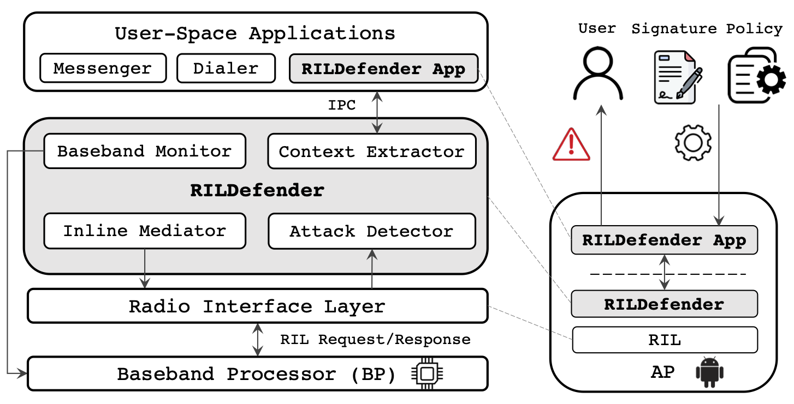

# RILDefender

## About This Project

This is the source code repository of our paper [Thwarting Smartphone SMS Attacks at the Radio Interface Layer](https://www.ndss-symposium.org/wp-content/uploads/2023/02/ndss2023_f432_paper.pdf) presented at the [Network and Distributed System Security Symposium 2023 (NDSS 2023)](https://www.ndss-symposium.org/). The major features of RILDefender are:

- The default capability to automatically **detect** and **block** six different types of SMS attacks, including:
	- Silent (Type-0) SMS, Binary SMS (e.g., [SIMJacker](https://simjacker.com/) and [WIBAttack](https://gbhackers.com/wibattack-sim/)), Flash (Class-0) SMS, Fake base station SMS, Malware SMS, and SMS generated from [Proactive SIMs](https://deepsec.net/docs/Slides/2021/Proactive_SIMs_David_Burgess.pdf).
- The flexible configuration of security policies per SMS exploit, SMS whitelisting, and new SMS attack signature described by `YAML` language (beta).
- View past SMS attack events that occur on your device.



RILDefender is developed on top of the [Android Open Source Project](https://source.android.com/) (AOSP) and open-sourced under [Apache License Version 2.0](https://www.apache.org/licenses/LICENSE-2.0). See [LICENSE](LICENSE) and [NOTICE](NOTICE).


## I. Installation Prerequisites  

**Caveat1**: This build took around 190GB of free disk space and up to a few hours to complete – otherwise don’t waste your time and space.

**Caveat2**: Flash RILDefender image will require a **BOOTLOADER-UNLOCKED** Android device and will likely wipe out your local data and thus is recommended to backup and refrain from using your personal devices.

**Caveat3**: PLEASE DO NOT FLASH INCOMPATIBLE VERSIONS OF IMAGES TO YOUR PHONE, as this might cause issues such as **boot loop**. Please use the Android versions that we have tested (see the table below). We might extend the support for other and future AOSP versions.

The following are instructions used for compiling RILDefender on Ubuntu Linux 20.04 and flashing the image to a **Unlocked** Android smartphone (e.g., a Google Pixel XL). It is adapted from the official [Building Android](https://source.android.com/docs/setup/build/building) guide. Adjustments may be needed for other Linux releases.

Install `repo` command  (see Google, varies per Linux version). For Debian/Ubuntu:

`sudo apt-get install repo`

Requirement:  `mm` requires installation of `m4`:

 `sudo apt-get install autoconf m4`

 Install `libncurses` and zip  – required for final compilation.

`$ sudo apt install -y libncurses5 zip`

Download AOSP Code Repository 

```
$ mkdir <AOSP_ROOT>
$ cd <AOSP_ROOT>
$ git config --global user.name <Your Name>
$ git config --global user.email you@example.com
$ repo init -u https://android.googlesource.com/platform/manifest -b <branch>
$ repo sync -c -j8 
```
(**Warning**: This step takes **HOURS** to complete: `-j8` lets us use 8 multiple threads)

For a list of branches, see [Source code tags and builds](https://source.android.com/setup/start/build-numbers#source-code-tags-and-builds) (e.g., used android-10.0.0_r1 for google pixel XL). For RILDefender, the currently supported AOSP versions are:

| Build ID        | Tag               | Version      | Supported Devices      |
|-----------------|:------------------|--------------|:-----------------------|
| TP1A.221005.002 | android-13.0.0_r7 | Android13    | Pixel 4, Pixel 4a, Pixel 4a (5G), Pixel 4 XL, Pixel 5, Pixel 5a (5G), Pixel 6, Pixel 6 Pro| 
| SQ1A.220205.002 | android-12.0.0_r28| Android12    | Pixel 3a, Pixel 3a XL, Pixel 4, Pixel 4 XL, Pixel 4a, Pixel 4a (5G), Pixel 5, Pixel 5a (5G) |
| RQ3A.211001.001 | android-11.0.0_r46| Android11    | Pixel 3, Pixel 3 XL, Pixel 3a, Pixel 3a XL, Pixel 4, Pixel 4 XL, Pixel 4a, Pixel 4a (5G), Pixel 5 |
| QP1A.190711.019 | android-10.0.0_r1 | Android10    | Pixel 3a XL, Pixel 3a, Pixel 3 XL, Pixel 3, Pixel 2 XL, Pixel 2, Pixel XL, Pixel | 
| N6F26Q          | android-7.1.1_r13 | Android7.1.1 | Nexus 6               |

 
## II. Prepare AOSP Environment

Detailed instructions of building original AOSP can be found at  
    [https://source.android.com/setup/build/building](https://source.android.com/setup/build/building)
 
You must start a bash shell if you are not using it. Then, from the AOSP_ROOT directory:   

`$ source build/envsetup.sh `

Select the target build (refer to [https://source.android.com/docs/setup/build/running#selecting-device-build](https://source.android.com/docs/setup/build/running#selecting-device-build) for the list of device build configurations):

`$ lunch <device_build>`

For instance, `lunch aosp_marlin-userdebug` for Pixel XL and  `lunch aosp_shamu-userdebug` for Nexus 6.


## III. Install the Driver Binaries 

Install the correct driver binaries of the specific **model** and **AOSP  build version**. The full list of drivers can be  downloaded from [https://developers.google.com/android/drivers 
](https://developers.google.com/android/drivers).

Download **ALL** the drivers to the AOSP root folder (`.tgz` files), extract them, and run the scripts. For instance, to install Pixel XL binaries for Android 10.0.0 (QP1A.190711.019)

```
$ wget https://dl.google.com/dl/android/aosp/google_devices-marlin-qp1a.190711.019-9f58521d.tgz 
$ wget https://dl.google.com/dl/android/aosp/qcom-marlin-qp1a.190711.019-4394281d.tgz
```

Extract the downloaded `.tgz` file, and execute the extracted `.sh` scripts at `<AOSP_ROOT>` (you will be asked to make consent to the license first).


## IV. Apply the RILDefender Source Patch 
        
Select the RILDefender source path we provide in this source code repository, such as [patches\_aosp10\_QP1A.190711.019](./patches_aosp10_QP1A.190711.019), as well as our automatic patching script [patch_apply.py](./patch_apply.py). The script takes two arguments: the aosp folder and the patch folder:

```
Please enter at least two arguments.
Usage: patch_apply.py -a <aosp_folder> -p <patch_folder>
```

For instance, to apply the AOSP10 RILDefender patches:

```$ patch_apply.py -a <AOSP_ROOT> -p patches_aosp10_QP1A.190711.019```

Currently, we have released four sets of RILDefender patches for AOSP 10-13:

- **AOSP 10 (QP1A.190711.019)**: [patches\_aosp10\_QP1A.190711.019](./patches_aosp10_QP1A.190711.019)
- **AOSP 11 (RQ3A.211001.001)**: [patches\_aosp11\_RQ3A.211001.001](./patches_aosp11_RQ3A.211001.001)
- **AOSP 12 (SQ1A.220205.002)**: [patches\_aosp12\_SQ1A.220205.002](./patches_aosp12_SQ1A.220205.002)
- **AOSP 13 (TP1A.221005.002)**: [patches\_aosp13\_TP1A.221005.002](./patches_aosp13_TP1A.221005.002)

## V. Compile the RILDefender AOSP Image        
  
Compile the telephony module (**WARNING**: This step takes a while). It is recommended to compile this module first before building the whole system image.

```
$ cd  <AOSP_ROOT>/frameworks/opt/telephony 
$ mm -j8  
```

Go to AOSP root and compile system images (use `-j` to specify the number of threads) (**WARNING**: This step may take hours to complete)

```
$ cd <AOSP_ROOT> 
$ make -j8
```


The compilation may fail in some stages and you need to run the following 3 commands. (**Should not happen now after removing some unncessary APIs**)   
 
```
$ make system-api-stubs-docs-update-current-api
$ make api-stubs-docs-update-current-api
$ make test-api-stubs-docs-update-current-api
```


## VI. Build and Flash the RILDefender System Image   
       
After a successful compilation, the generated images can be found at `<AOSP_ROOT>/out/target/product/<MODEL>`
The `<MODEL>` is denoted by a specific code name, such as `marlin` for Pixel XL. 

Next, prepare a `.zip` file for flashing

```
$ cd ./out/target/product/marlin
$ zip rildefender.zip ./*
```

Install the Compiled Image into your Android device. Before flashing, make sure the bootloader is [unlocked](https://source.android.com/docs/core/architecture/bootloader/locking_unlocking), which can be enabled in the settings UI and then execute the following command

```
$ fastboot flashing unlock  
```

at the bootloader or other model-specific commands that are available online (Note: the above will not work for vendor lock-in devices).

The following shows the method used to install `rildefender.zip` into an Android smartphone from a machine that has the [Android SDK Platform Tools](https://developer.android.com/studio/releases/platform-tools) ([adb](https://developer.android.com/studio/command-line/adb) and [fastboot](https://android.googlesource.com/platform/system/core/+/master/fastboot/#fastboot)) installed.

- Connect phone to computer via USB. (ensure your phone has [developer mode](https://developer.android.com/studio/debug/dev-options) enabled)
- Initiate ADB from computer with phone attached and on (phone will prompt for  permission)   

```
$ adb reboot fastboot
$ fastboot -w update rildefender.zip  
```

Note: There are alternate method to Flash image, depending on the phone model:

For example, alternate flashing for a device:

Place the device in fastboot mode by holding the appropriate key combination at boot or using the following command:    

```
$ adb reboot bootloader
```

After the device is in fastboot mode, run: 

```
$ fastboot flashall -w
```

in the folder with the compiled images. 

You may selectively flash a specific image partition (e.g., `system.img`) using 

```
$ fastboot flash system system.img
```

## VII. Install the RILDefender app
 
The RILDefender app is compiled as a standalone fashion. You can also directly use the precompiled [RILDefender.apk](prebuild/RILDefender.apk). 

For detailed instructions, please refer to the RILDefender app [README](RILDefender-App/README.md).


## VIII. TODO

- Sender SMS whitelisting
- Extend RILDefender's support for other AOSP versions


## IX. Publication

Please cite our paper if you develop a research work or product based on RILDefender.

```
@inproceedings{RILDefender:NDSS23,
  title     = {Thwarting Smartphone SMS Attacks at the Radio Interface Layer},
  author    = {Wen, Haohuang and Porras, Phillip and Yegneswaran, Vinod and Lin, Zhiqiang},
  booktitle = {Proceedings of the 30th Annual Network and Distributed System Security Symposium (NDSS'23)},
  address   = {San Diego, CA},
  month     = {February},
  year      = 2023,
}
```
